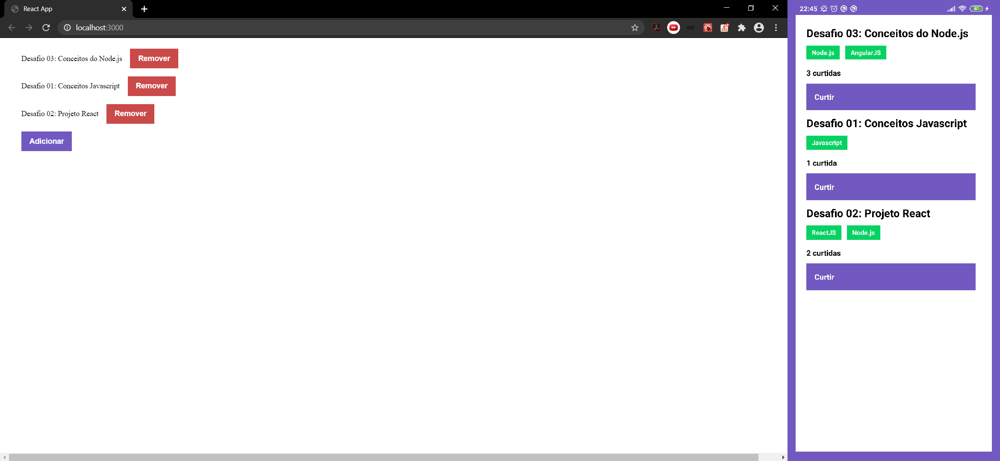

   

# Repository Manager
A simple application to store repositories of your portfolio, that it will allow you to create, list, update and remove repositories. And also, it will allow you to give "likes" to repositories.

The app was build with Node.js and Express(backend), ReactJS(frontend) and React Native (mobile), it is part of Rocketseat bootcamp.

## Content
- [Backend](./backend) 
- [Frontend](./frontend)
- [Mobile](./mobile)

---
Desenvolvido com :purple_heart: por [Marcelo Palmieri](https://www.linkedin.com/in/marcelo-palmieri)